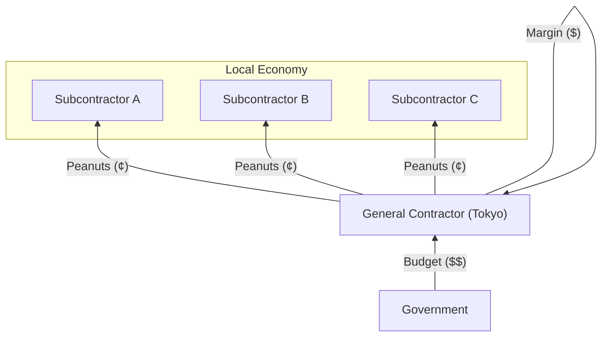
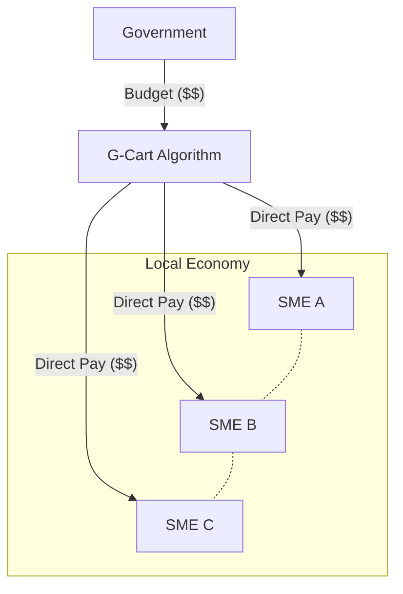

# Theoretical Foundation: SBCM Economics and G-Cart
**― Algorithmic Correction of Regional Wealth Leakage ―**

G-Cart is not merely a matching application. It is the software implementation of **"SBCM Economics,"** a meso-economic framework designed to maximize regional wealth retention.
This document explains the mathematical logic and economic principles governing the G-Cart algorithm.

---

## 1. The Core Problem: The Straw Effect (ストロー効果)

In the traditional construction industry structure, massive public works projects inevitably lead to the **leakage of wealth** from local economies to central metropolises (e.g., Tokyo). SBCM defines this phenomenon physically as the "Straw Effect."

### 1.1 The Leakage Equation
When the budget of a single project ($I_{budget}$) exceeds the capacity of a single local contractor ($C_{single}$), the Leakage Rate ($\lambda$) approaches 100%.

$$ \text{If } I_{budget} \gg C_{single} \implies \lambda \to 1.0 \quad (100\% \text{ Leakage}) $$

*   **Mechanism:** Local SMEs cannot bid on large projects alone due to insufficient capital or labor.
*   **Result:** The project is awarded to a "General Contractor" (Zen-ne-kon) in the capital.
*   **Economic Impact:** The budget flows out of the region as "management fees" and "outsourcing costs," leaving only minimal wages for local laborers.

---

## 2. The Solution: Virtual General Contractor (バーチャル・ゼネコン)

G-Cart functions as a **"Virtual General Contractor."** It replaces the management and matching functions of a traditional general contractor with algorithms, enabling local SMEs to form a **Joint Venture (JV)** instantly.

### 2.1 Capacity Synthesis (キャパシティの合成)
G-Cart aggregates the fragmented capacities of local SMEs to exceed the project budget threshold.

$$ \sum_{i=1}^{n} C_{local\_i} \ge I_{budget} \implies \lambda \to 0.0 \quad (0\% \text{ Leakage}) $$

By bundling $n$ local companies (e.g., civil engineering + paving + electrical), the system creates a **"Virtual Large Enterprise"** that meets the bidding requirements without relying on external general contractors.

### 2.2 Algorithm Logic
The matching engine of G-Cart operates on the following logic to maximize the **Block Retention Rate ($R_{block}$)**:

1.  **Decomposition:** The system parses the project requirements into sub-components (Tags).
2.  **Search:** It searches for local entities within the same Standard Block that match these tags.
3.  **Optimization:** It prioritizes combinations that minimize geographical distance and maximize total capacity utilization.

---

## 3. Key Metrics (KPIs)

G-Cart optimizes the following two economic indicators defined in SBCM.

### 3.1 Block Retention Rate ($R_{block}$)
The percentage of the budget that remains within the local economy.

$$ R_{block} = \frac{\text{Budget distributed to Local Entities}}{\text{Total Project Budget}} $$

*   **Traditional Model:** $R_{block} \approx 20\%$ (Leakage to HQ)
*   **G-Cart Model:** $R_{block} \approx 95\%$ (Direct Distribution)

### 3.2 Budget Distortion Index ($D_{index}$)
The measure of cost-effectiveness relative to the Standard Block ($B_{std}$). G-Cart creates transparency, allowing "distorted" (overpriced) projects to be identified by comparing unit prices across regions.

$$ D_{index} = \frac{\text{Normalized Budget}}{\text{Normalized Coverage}} $$

---

## 4. Visualizing the Paradigm Shift

### Traditional Model (Pyramid)
Wealth is sucked up to the top.

### G-Cart Model (Network)
Wealth circulates within the region.

---

## 5. Conclusion

G-Cart is a tool to **democratize public procurement** and **restore regional economic autonomy**. By replacing the "middleman" with "code," we mathematically guarantee that tax money serves the community it was collected from.
